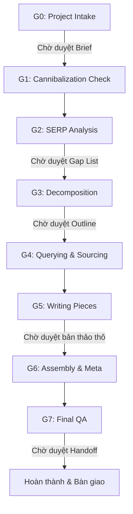

# 🤖 SEO AI Overview Agent — SKILL.md

## Mô tả

Skill này biến AI Agent thành một **SEO Co-pilot** thực sự: nhận keyword → tự chạy toàn bộ pipeline research + phân tích + viết + QA → bàn giao bài viết hoàn chỉnh.

**Triết lý cốt lõi:** AI Overview cho biết Google đang tổng hợp những gì đã có. Bài mới không được spin lại — mà phải cung cấp những gì AI Overview **không có**: số liệu địa phương, case study thực tế, phân tích chuyên sâu, cảnh báo thực chiến.

---

## 🚀 Cách trigger skill này

Các câu lệnh/yêu cầu sẽ kích hoạt skill:
- `"Viết bài SEO về [keyword]"`
- `"Tạo bài chuẩn AI Overview về [chủ đề]"`
- `"Research và viết content SEO cho [topic]"`
- `/seo-ai-overview [keyword]`
- `/seo [keyword]`

---

## 📋 Yêu cầu

**Tools cần có:**
- `search_web` — Tìm kiếm SERP, phân tích AI Overview, query từng mảnh nội dung
- `browser_subagent` — Crawl nội dung top bài rank, đọc chi tiết nguồn Tier 1-2

**Fallback khi không có search:**
- Agent yêu cầu user paste thủ công: nội dung AI Overview, heading top 5 bài, raw data từng mảnh
- Vẫn có thể thực hiện G0, G3, G5, G6, G7 mà không cần search

## Tool Availability Gate (BẮT BUỘC ở G0)

Trước khi chạy G1:

1. Kiểm tra tool availability:
   - Có `search_web` không?
   - Có `browser_subagent` không?
2. Nếu thiếu một hoặc cả hai:
   - Báo rõ tool nào thiếu.
   - Chuyển sang chế độ `manual-evidence`.
   - Yêu cầu user cung cấp input thay thế (AI Overview copy, top URL, raw facts).
3. Không được silent fail. Mọi fallback phải được thông báo rõ trong Intake Brief.

---

## 📂 Cấu trúc skill

```
seo-ai-overview/
├── SKILL.md                    ← File này (entry point)
├── stages/
│   ├── g0_intake.md
│   ├── g1_cannibalization.md
│   ├── g2_serp_analysis.md
│   ├── g3_decomposition.md
│   ├── g4_querying.md
│   ├── g5_writing.md
│   ├── g6_assembly.md
│   └── g7_final_qa.md
├── templates/
│   ├── intake_brief.md
│   ├── gap_list.md
│   ├── outline.md
│   ├── content_map.md
│   ├── handoff_package.md
│   └── prompts/
│       ├── m1_overview.md … m8_faq.md
└── resources/
    ├── blacklist_patterns.md
    ├── source_tier_guide.md
    ├── ymyl_guide.md
    └── qa_checklist.md
```

---

## ▶️ AI STEP-BY-STEP EXECUTION PROTOCOL (BẮT BUỘC)

Khi nhận được yêu cầu viết bài SEO hoặc tạo bài viết chuẩn AI Overview, AI Agent phải thực thi tuần tự pipeline 8 giai đoạn sau đây. **Tuyệt đối không gộp giai đoạn hoặc tự ý điền thông tin mà chưa được duyệt qua các điểm chốt (Checkpoint).**



### Giai đoạn 0: Project Intake (Checkpoint 1)
- **Hành động**: Đọc [g0_intake.md](file:///c:/Users/Trong/Downloads/Anti-WorkFlows-main/skills/seo-ai-overview/stages/g0_intake.md). Thu thập thông tin từ user (Từ khóa, Domain, Đối tượng, Độ dài, Ý muốn đặc biệt).
- **Tool check**: Kiểm tra sự sẵn có của `search_web` và `browser_subagent`. Nếu thiếu, báo rõ cho user và chuyển sang chế độ `manual-evidence`.
- **Yêu cầu**: Xuất bản **Intake Brief** và chờ user duyệt.

### Giai đoạn 1: Cannibalization Check
- **Hành động**: Đọc [g1_cannibalization.md](file:///c:/Users/Trong/Downloads/Anti-WorkFlows-main/skills/seo-ai-overview/stages/g1_cannibalization.md). Kiểm tra xem domain của khách hàng đã có bài viết nào trùng ý định tìm kiếm (Intent) chưa.
- **Quyết định**: Đề xuất hành động (Tạo mới hoàn toàn / Cập nhật bài cũ / Gộp bài / Chuyển hướng URL).

### Giai đoạn 2: SERP Analysis & Gap Mapping (Checkpoint 2)
- **Hành động**: Đọc [g2_serp_analysis.md](file:///c:/Users/Trong/Downloads/Anti-WorkFlows-main/skills/seo-ai-overview/stages/g2_serp_analysis.md). Phân tích nội dung AI Overview hiện tại và top 5 đối thủ.
- **Yêu cầu**: Lập **Gap List (3-5 điểm)** dựa trên *Bảng checklist khoảng trống nội dung* bên dưới. **Chờ user duyệt Gap List trước khi đi tiếp.**

### Giai đoạn 3: Topic Decomposition (Checkpoint 3)
- **Hành động**: Đọc [g3_decomposition.md](file:///c:/Users/Trong/Downloads/Anti-WorkFlows-main/skills/seo-ai-overview/stages/g3_decomposition.md). Chia chủ đề lớn thành 5-8 mảnh nội dung độc lập (Sub-topics).
- **Yêu cầu**: Tạo **Outline** chi tiết, gán các Gap đã duyệt vào từng mảnh tương ứng. **Chờ user duyệt Outline.**

### Giai đoạn 4: Data Querying & Sourcing
- **Hành động**: Đọc [g4_querying.md](file:///c:/Users/Trong/Downloads/Anti-WorkFlows-main/skills/seo-ai-overview/stages/g4_querying.md). Tìm kiếm và thu thập số liệu thực tế cho từng mảnh. Phân loại nguồn tin theo Tier (Tier 1: Báo cáo ngành chính phủ, Tier 2: Báo chí chính thống, Tier 3: Blog cá nhân).

### Giai đoạn 5: Writing Pieces (Checkpoint 4)
- **Hành động**: Đọc [g5_writing.md](file:///c:/Users/Trong/Downloads/Anti-WorkFlows-main/skills/seo-ai-overview/stages/g5_writing.md). Viết nháp từng mảnh. Rà soát ngôn từ chống lại văn phong AI (AI patterns).
- **Yêu cầu**: Gửi bản nháp thô ráp nối cho user đọc thử và phản hồi.

### Giai đoạn 6: Assembly & Meta Assets
- **Hành động**: Đọc [g6_assembly.md](file:///c:/Users/Trong/Downloads/Anti-WorkFlows-main/skills/seo-ai-overview/stages/g6_assembly.md). Lắp ghép các mảnh thành bài viết hoàn chỉnh. Viết Meta Description, Alt Text cho ảnh, tạo cấu trúc FAQ Schema dạng JSON-LD.

### Giai đoạn 7: Final QA & Handoff (Checkpoint 5)
- **Hành động**: Đọc [g7_final_qa.md](file:///c:/Users/Trong/Downloads/Anti-WorkFlows-main/skills/seo-ai-overview/stages/g7_final_qa.md). Chạy bộ lọc 8 tiêu chí kiểm tra chất lượng SEO & AI Overview.
- **Yêu cầu**: Tạo **Handoff Package** hoàn chỉnh và bàn giao cho user.

---

## 🔍 AI OVERVIEW CONTENT GAPS CHECKLIST

Khi thực hiện **Giai đoạn 2 (SERP Analysis)**, AI phải chủ động đối chiếu nội dung hiện tại của Google AI Overview và các bài viết đang đứng top đầu để tìm ra ít nhất 3 khoảng trống (Gaps) thuộc các nhóm sau. Không được viết bài nếu không tìm ra gap cụ thể.

### 1. Số liệu địa phương & Thời gian thực (Localized & Temporal Data)
- [ ] **Báo cáo thị trường nội địa**: AI Overview có trích dẫn số liệu cụ thể tại Việt Nam (hoặc địa phương mục tiêu) không?
- [ ] **Cập nhật năm hiện tại (2026)**: Các số liệu đối thủ đang dùng có bị cũ (ví dụ: dùng số liệu năm 2022-2023) không?
- [ ] **Biến động giá cả thực tế**: Có bảng khảo sát giá thực tế tại các cửa hàng nội địa thay vì giá chung chung toàn cầu không?

### 2. Trải nghiệm thực tế & Bằng chứng Hands-on (First-Hand Experience)
- [ ] **Hình ảnh/Video tự chụp**: Đối thủ có ảnh chụp cận cảnh trải nghiệm sử dụng thực tế sản phẩm không, hay chỉ dùng ảnh mạng/stock?
- [ ] **Nhật ký thử nghiệm (Logs/Test notes)**: Có ghi chép chi tiết về các lỗi phát sinh, thời gian setup, hoặc khó khăn thực tế khi dùng sản phẩm/dịch vụ không?
- [ ] **Ghi chú cá nhân độc quyền**: Những bài học "xương máu" rút ra sau khi tự tay trải nghiệm sản phẩm là gì?

### 3. Ý kiến chuyên gia & Cảnh báo rủi ro (Expert Insights & Warnings)
- [ ] **Trích dẫn chuyên gia đầu ngành**: Bài viết có trích dẫn trực tiếp lời khuyên từ bác sĩ, kỹ sư, chuyên gia tài chính có chứng chỉ (EEAT) không?
- [ ] **Cảnh báo tác dụng phụ / Rủi ro**: Đối thủ có dám nói thẳng các điểm yếu, tác hại tiềm ẩn hay những đối tượng KHÔNG nên sử dụng sản phẩm/dịch vụ này không?
- [ ] **So sánh đối đầu không thiên vị**: Có bảng so sánh chi tiết ưu-nhược điểm của các giải pháp thay thế dựa trên ý kiến chuyên môn không?

### 4. Giải pháp Actionable từng bước (Actionable Step-by-Step Workarounds)
- [ ] **Hướng dẫn sửa lỗi thực tế**: Có các dòng lệnh, đoạn code hay chỉ dẫn từng bước để giải quyết một lỗi cụ thể mà AI Overview chỉ tóm tắt chung chung không?
- [ ] **Checklist tải về được**: Có cung cấp file PDF, Google Sheets mẫu hoặc checklist để người dùng áp dụng làm theo ngay lập tức không?

---

## ⚠️ Quy tắc cứng — KHÔNG được vi phạm

1. **Không bịa đặt số liệu (No Hallucination)**: Thà ghi rõ placeholder `[Sếp bổ sung số liệu thật]` còn hơn tự bịa một con số/tên tổ chức.
2. **Không tạo Cannibalization**: Tuyệt đối không viết bài mới có cùng Intent với một bài viết đã có trên website của khách hàng.
3. **Không được bỏ qua QA G7**: Mọi bài viết trước khi bàn giao phải được kiểm duyệt qua 8 tiêu chí khắt khe tại stage G7.
4. **Không spin lại AI Overview**: Bài viết mới phải cung cấp giá trị bổ sung độc bản (Unique Selling Point) để thuyết phục Google kéo trích dẫn từ bài của bạn thay vì đối thủ.
5. **YMYL (Your Money Your Life)**: Nếu bài viết thuộc chủ đề Tài chính hoặc Y tế, chỉ sử dụng nguồn từ Tier 1 và Tier 2.

---

## 📊 Outputs cuối cùng (Handoff Package)

Sau khi hoàn thành G7, agent bàn giao **Handoff Package** gồm:
1. ✅ **Full draft bài viết**: Định dạng Markdown hoặc HTML sẵn sàng đăng tải.
2. ✅ **QA Report**: Kết quả kiểm tra 8 tiêu chí (Đạt/Không đạt).
3. ✅ **Verify List**: Danh sách các con số/dữ kiện cần khách hàng xác nhận lại tính chính xác trước khi xuất bản.
4. ✅ **Meta Assets**: Thẻ Title, Meta Description tối ưu CTR, Alt Text hình ảnh, FAQ Schema JSON-LD.
5. ✅ **Content Map**: Cập nhật trạng thái bài viết vào sơ đồ nội dung tổng thể.
